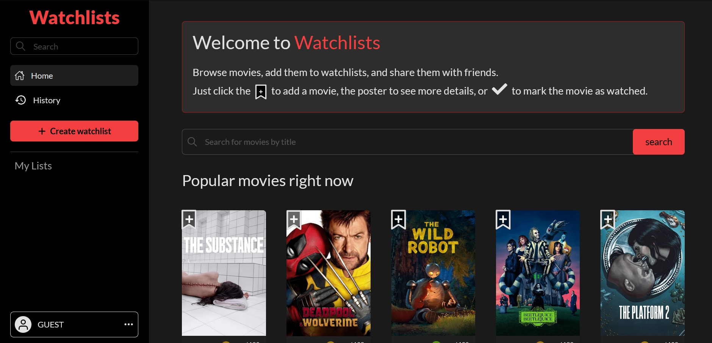
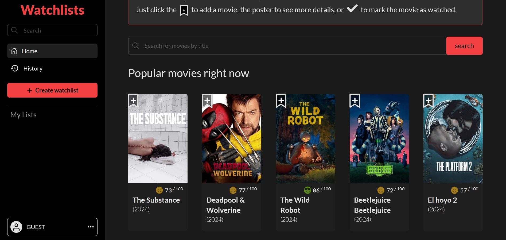
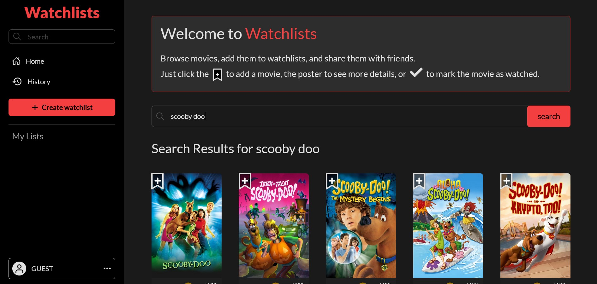

# Watchlists

A web application that allows users to create and manage their movie watchlists. This project uses the TMDB (The Movie Database) API to fetch movie data.

## Features

- Browse and search for movies
- Create a personal watchlist
- View movie details, including ratings and reviews

## Technologies Used

- React
- Tailwind CSS
- TMDB API
- Vite

## Live Demo

[Watchlists Live Demo](https://watchlist-test.netlify.app/)

## Installation

To set up the project locally, follow these steps:

1. **Clone the Repository**
   ```bash
   git clone https://github.com/faizkhan-06/watchlists.git
   ```
2. **Navigate to the Project Directory**

   ```bash
   cd watchlists
   ```

3. **Install Dependencies**

   ```bash
   npm install
   ```

4. **Create a `.env` File**
   Create a `.env` file in the root directory of the project and add your TMDB API key:

   ```
   VITE_TMDB_API_KEY=your_api_key_here
   ```

5. **Start the Development Server**

   ```bash
   npm run dev
   ```

6. **Open the Application**
   Open your web browser and navigate to `http://localhost:5173`.

## Screenshots

Here are some screenshots of the application:

### Homepage



### Movie Detail



### Search



## API Used

This project utilizes the TMDB API to fetch movie data. You can find the API documentation [here](https://developers.themoviedb.org/3).

### TMDB API Key

You will need to sign up for a TMDB account and generate an API key to access the movie data. Follow these steps:

1. Go to [TMDB](https://www.themoviedb.org/).
2. Sign up or log in to your account.
3. Navigate to your account settings and generate a new API key.
4. Add the API key to your `.env` file as described above.

## Acknowledgements

- [TMDB API](https://www.themoviedb.org/)
- [React](https://reactjs.org/)
- [Tailwind CSS](https://tailwindcss.com/)
